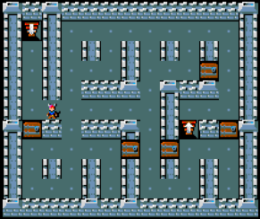

# Abstract

The Hierarchical Reasoning Model (HRM) has impressive reasoning abilities given its small size, but has only been applied to supervised, static, fully-observable problems. One of HRM's strengths is its ability to adapt its computational effort to the difficulty of the problem. However, in its current form it cannot integrate and reuse computation from previous time-steps if the problem is dynamic, uncertain or partially observable, or be applied where the "correct" action is undefined, characteristics of many real-world problems.

This paper presents HRM-Agent, a variant of HRM trained using only reinforcement learning. We show that HRM can learn to navigate to goals in dynamic and uncertain maze environments. Recent work suggests that HRM's reasoning abilities stem from its recurrent inference process. We explore the dynamics of the recurrent inference process and find evidence that it is successfully reusing computation from earlier environment time-steps.

You can read the whole paper here: [Paper](https://arxiv.org/abs/2510.22832)

# Code

This code base is modified version of the original [HRM repo](https://github.com/sapientinc/HRM) and relies on CUDA 12.4 instead. The setup instruction in that repo has been incorporated into a Makefile in this code base, but aside from different dependencies on CUDA version, all other set up remains the same.

The Makefile can be invoked with

```
make all
```

Configurations of the training is set in `rl/config`

To perform training, run `rl/dqn_train_loop.py`

This code base was written for single GPU training and may not work with multiple GPUs without slight modification.

Inference and testing are performed in notebooks. To play the environments yourself, use `notebook_scripts/test_rl_dataset.py`

Successful training should result in 99% navigation success after approx. 100K mb.


# Citation

```
@misc{HRMAgent,
      title={HRM-Agent: Training a recurrent reasoning model in dynamic environments using reinforcement learning}, 
      author={Long H Dang and David Rawlinson},
      year={2025},
      eprint={2510.22832},
      archivePrefix={arXiv},
      primaryClass={cs.AI},
      url={https://arxiv.org/abs/2510.22832},
}
```